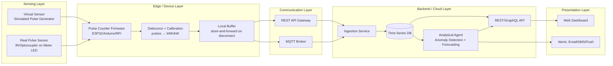
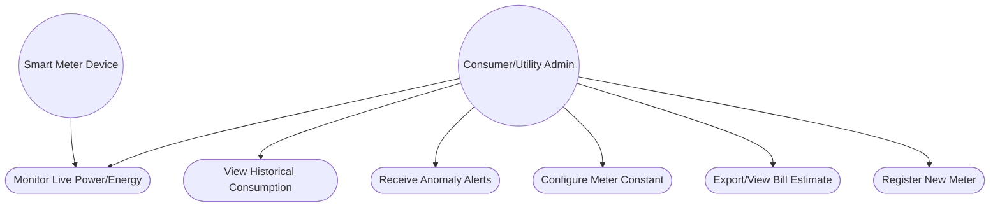
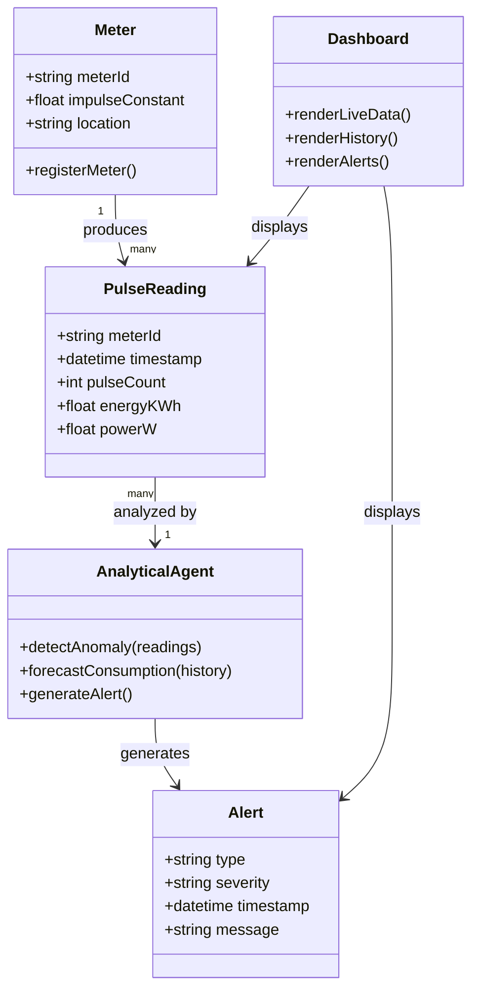
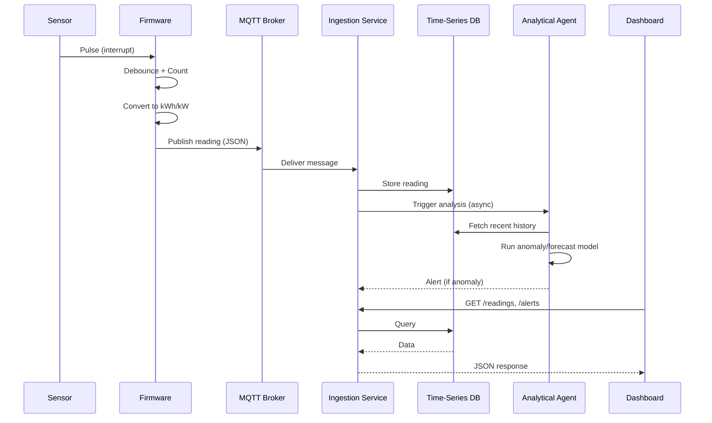
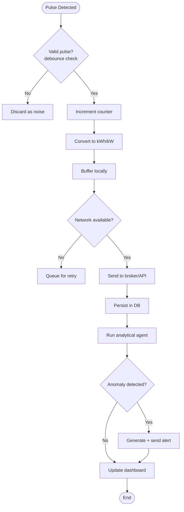
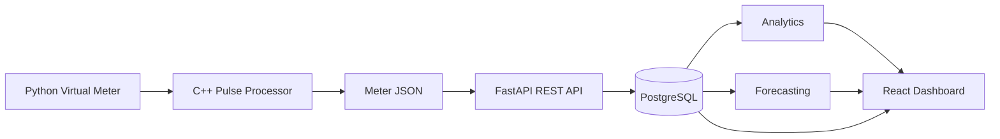
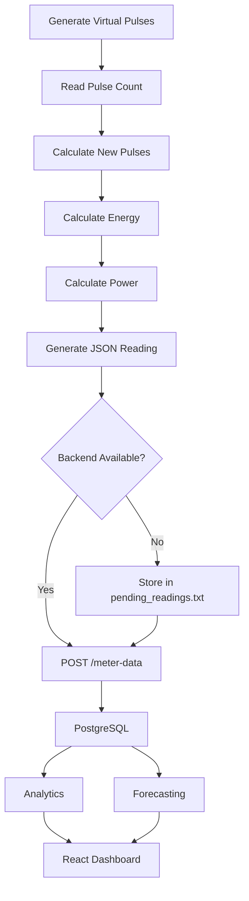

# Smart Energy Smart-Meter Pulse Counter & Analytics Agent

## Design Diagrams

---

## 1. High-Level Architecture

The capstone architecture is organized into sensing, edge/device, communication, backend/cloud, and presentation layers.



### Implementation Note

For this software-only implementation, the **Virtual Sensor** path is used instead of physical smart-meter hardware. The communication path implemented in the project uses the **REST API** route rather than MQTT.

---

## 2. Use Case Diagram



### Main Use Cases

- Monitor live power and energy
- View historical consumption
- Receive anomaly alerts
- Configure meter constant
- View bill estimate
- Register a new meter

---

## 3. Class Diagram



---

## 4. Sequence Diagram

The sequence below represents the end-to-end flow defined in the capstone architecture.



### Implementation Note

The actual project currently uses:

```text
Virtual Meter
      ↓
C++ Pulse Processor
      ↓
REST API
      ↓
PostgreSQL
      ↓
Analytics / Forecasting
      ↓
React Dashboard
```

Therefore, the `MQTT Broker` and generic `Ingestion Service` shown above are part of the **guide architecture**, not components currently used in this implementation.

---

## 5. Activity Diagram



---

## 6. Project-Specific Architecture

The current software implementation can be represented as:



---

## 7. Project-Specific Data Flow



---

## 8. Component Mapping

| System Component        | Project Implementation                       |
| ----------------------- | -------------------------------------------- |
| Virtual Sensor          | `analytics/virtual_meter.py`                 |
| Pulse Processing        | `firmware/pulse_counter.cpp`                 |
| Local Configuration     | `data/meter_configs.txt`                     |
| Local Store-and-Forward | `data/pending_readings.txt`                  |
| REST Backend            | `backend/main.py`                            |
| Database                | PostgreSQL                                   |
| Analytics               | `backend/main.py` / `analytics/analytics.py` |
| Forecasting             | `analytics/forecast.py`                      |
| Dashboard               | React.js + Recharts                          |

---

## 9. Supported Meters

```text
M001
M002
```

Each meter has its own pulse counter and meter configuration.

---

## 10. Design Summary

The system follows a layered smart-meter architecture in which pulse data is generated, processed, transmitted, stored, analyzed, forecasted, and visualized.

The implementation uses a **software-based virtual sensor**, allowing the complete system to be demonstrated without physical smart-meter hardware.
